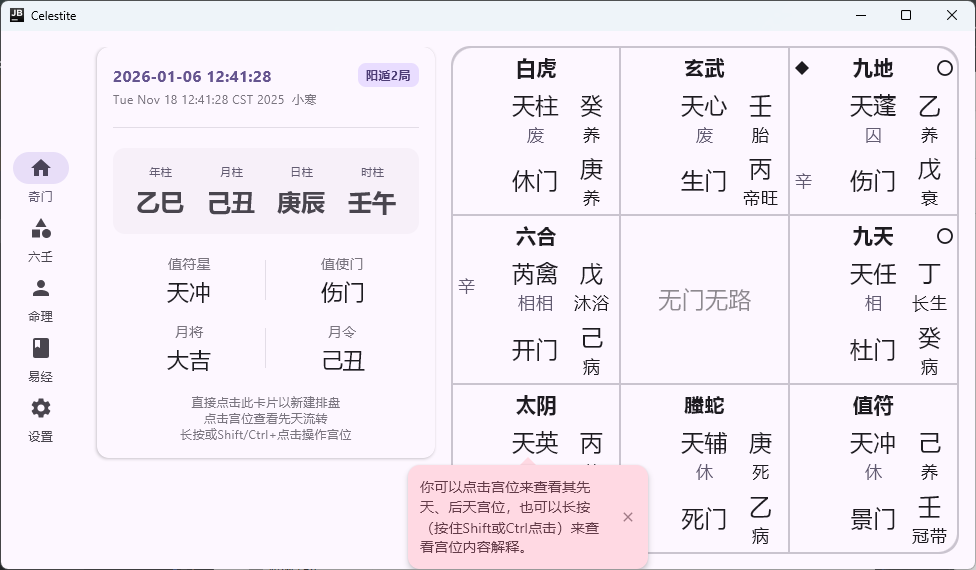
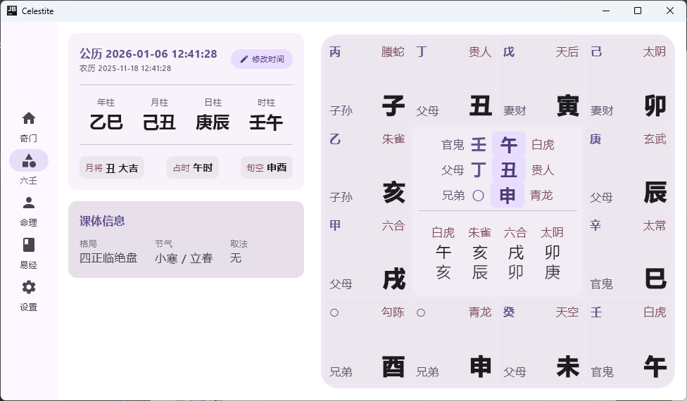
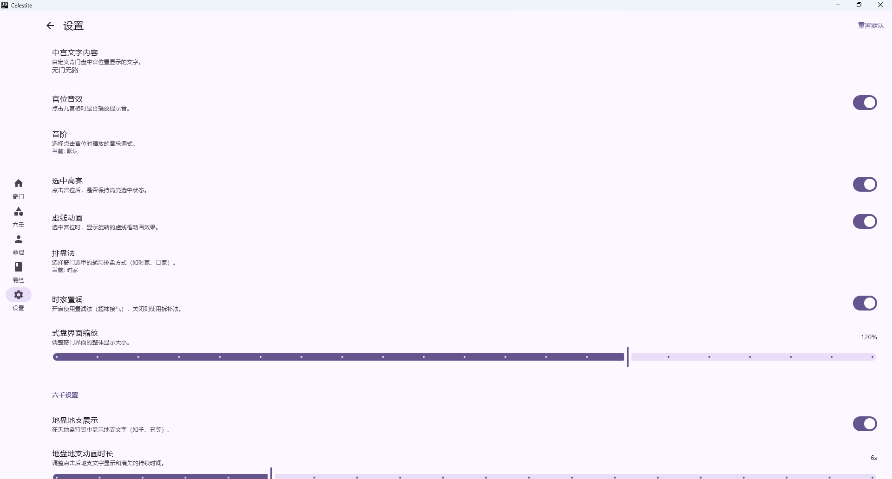
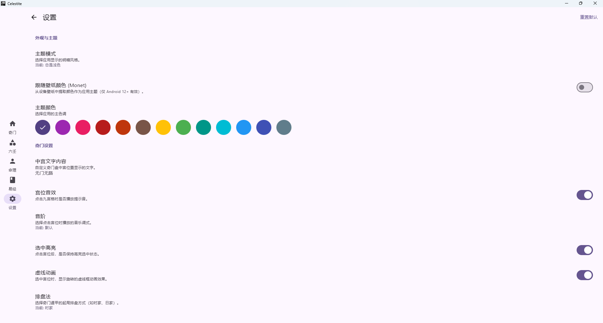

# Celestite (天青石)


-brightgreen.svg)


**Celestite** 是一款基于 **Kotlin Multiplatform (KMP)** 开发的现代化中华术数排盘软件。

本项目旨在利用现代化的 **Material 3** 设计语言和 **Compose** 声明式 UI，为传统术数（奇门遁甲、大六壬等）赋予优雅的视觉体验和交互逻辑。

> [!warning]
> 本项目目前专注于 Android 和 Desktop (JVM) 平台，暂无 iOS 支持计划。

## ✨ 特色功能 (Features)

*   **🎨 极致的 Material Design 3**
    *   完全遵循 M3 设计规范，支持动态取色 (Dynamic Color/Monet)。
    *   内置多种高雅主题配色，支持深色模式 (Dark Mode) 自动切换。
    *   **响应式布局**：根据屏幕宽度自动在底部导航栏 (BottomBar) 和侧边导航轨 (Navigation Rail) 之间切换，完美适配手机与桌面端。

*   **🔮 专业排盘**
    *   **奇门遁甲**：支持拆补法、置闰法，盘面清晰直观。
    *   **大六壬**：提供详细的三传四课与神煞信息。
    *   **交互式解盘**：点击宫位即可查看先后天，长按/Shift点击可查看解析。

*   **🎵 视听通感 (Synesthesia)**
    *   **可听的盘面**：支持点击宫位演奏音律。
    *   **五音对应**：内置“中国传统五声调式”与“C大调”映射，根据宫位索引触发不同频率，让排盘不仅可见，亦可听。

*   **🛠️ 高度自定义**
    *   支持自由调节盘面缩放比例、文字大小。
    *   可配置动画速率、虚线特效、选中高亮等视觉反馈。

## 📸 预览 (Screenshots)

| 首页与时间选择 | 奇门遁甲排盘 | 大六壬排盘 |
| :---: | :---: | :---: |
|  |  |  |

| 个性化设置 | 主题与外观 |
| :---: | :---: |
|  |  |

## 🛠 技术栈 (Tech Stack)

本项目采用纯 Kotlin 开发，利用 KMP 实现代码共享。

*   **Core**: [Kotlin Multiplatform](https://kotlinlang.org/docs/multiplatform.html)
*   **UI Framework**: [Compose Multiplatform](https://github.com/JetBrains/compose-multiplatform) (Material 3)
*   **Navigation**: [Voyager](https://github.com/adrielcafe/voyager) (TabNavigator, Transitions)
*   **Settings**: [Multiplatform Settings](https://github.com/russhwolf/multiplatform-settings)
*   **Network**: [Ktor](https://ktor.io/)
*   **Logging**: [Logback](https://logback.qos.ch/) / SLF4J

### 核心算法库：xuan-utils-pro (Modified)

本项目的术数运算核心逻辑源自开源项目 [xuan-utils-pro](https://gitee.com/shan-dai/xuan-utils-pro)。
为了适应 KMP 架构与现代化构建需求，Celestite 对其进行了深度定制与重构：

1.  **构建迁移**：从 Maven 迁移至 Gradle (Kotlin DSL)，完全融入 KMP 生态。
2.  **代码净化**：移除了原项目中无法正常使用的 WebUI 代码和依赖，仅保留核心算法。
3.  **功能增强**：在原有基础上新增了 **置闰法** (Intercalation) 的算法支持。

## 🚀 快速开始 (Getting Started)

### 环境要求
*   JDK 17+
*   Android Studio (Ladybug 或更新版本) 或 IntelliJ IDEA

### 运行 Android
```bash
./gradlew :composeApp:installDebug
```

### 运行 Desktop (JVM)
```bash
./gradlew :composeApp:run
```

## 🤝 贡献与致谢

*   感谢 [shan-dai](https://gitee.com/shan-dai) 提供的 `xuan-utils-pro` 算法基础。
*   感谢 JetBrains 团队提供的 Compose Multiplatform 框架。

---
*Created with ❤️ by xiaozhao45*
